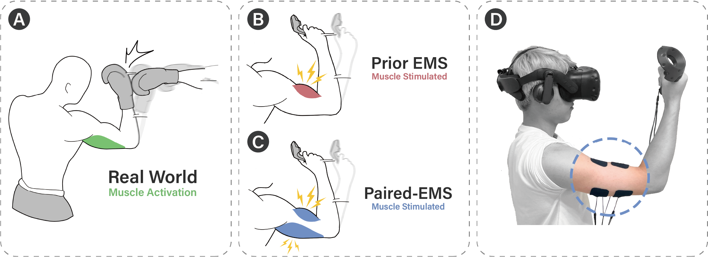
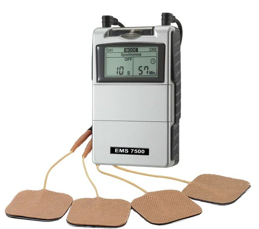
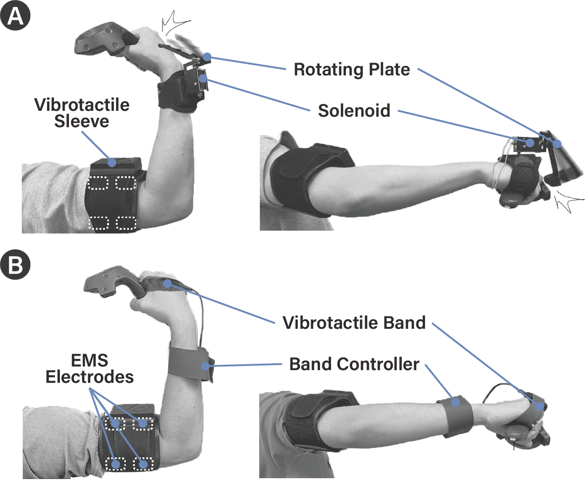
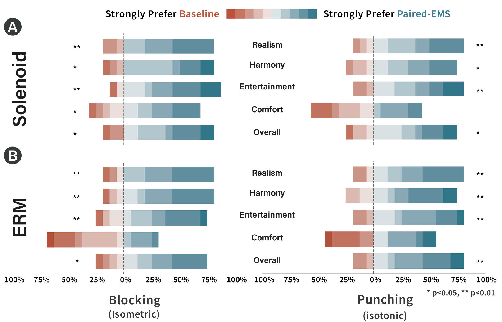

<!-- Improved compatibility of back to top link: See: https://github.com/othneildrew/Best-README-Template/pull/73 -->

<!--
*** Thanks for checking out the Best-README-Template. If you have a suggestion
*** that would make this better, please fork the repo and create a pull request
*** or simply open an issue with the tag "enhancement".
*** Don't forget to give the project a star!
*** Thanks again! Now go create something AMAZING! :D
-->

<!-- PROJECT SHIELDS -->
<!--
*** I'm using markdown "reference style" links for readability.
*** Reference links are enclosed in brackets [ ] instead of parentheses ( ).
*** See the bottom of this document for the declaration of the reference variables
*** for contributors-url, forks-url, etc. This is an optional, concise syntax you may use.
*** https://www.markdownguide.org/basic-syntax/#reference-style-links
-->

<!-- PROJECT LOGO -->
 

  

<h3 align="center">Paired-EMS: Enhancing Electrical Muscle Stimulation (EMS)-based Force Feedback Experience by Stimulating Both Muscles in Antagonistic Pairs</h3>

  

     
    <a href="https://dl.acm.org/doi/10.1145/3613904.3642841"><strong> Read the Paper » ACM CHI'24 Paper</strong></a>
     
    (Overall Acceptance Rate 6,199 of 26,314 submissions, 24%)
     
     
    <strong> View Demo Video</strong>
     
    <a href="https://www.youtube.com/watch?v=7NbJ0tl-Qlc"><strong>30s Preview</strong></a> 
    &middot;
    <a href="https://www.youtube.com/watch?v=wXZyBsOmNBc"><strong>Paper Presentation</strong></a>
<!--     &middot;
    <a href="https://github.com/github_username/repo_name/issues/new?labels=enhancement&template=feature-request---.md">Request Feature</a> -->
  

<!-- ABOUT THE PROJECT -->
## About The Paper

Electrical Muscle Stimulation (EMS) has emerged as a key wearable haptic feedback technology capable of simulating a wide range of force feedback, such as the impact force of boxing punches, the weight of virtual objects, and the reaction force from pushing on a wall. To simulate these external forces, EMS stimulates the muscles that oppose (i.e. antagonistic to) the actual muscles that users activate, causing involuntary muscle contraction and haptic sensations that differ from real-world experiences. In this work, we propose Paired-EMS which simultaneously stimulates both the muscles that users activate and that prior EMS stimulates (i.e. antagonistic muscle pairs) to enhance the external force feedback experience. We first conducted a small formative study (n=8) to help design the stimulation intensity of muscle pairs, then conducted a user experience study to evaluate Paired-EMS vs. prior EMS approaches for both isometric and isotonic user actions. Study results (n=32) showed that Paired-EMS significantly improved realism, harmony, and entertainment (p<.05) with similar comfort (p>.36), and was overall preferred by 78% of participants (p<.01).

### Built With

* [![Unity][unity-shield]][unity-url]
* [![Arduino][arduino]][arduino-url]
* ![C#][C#-s]
* 
* [![HTC][HTC-s]][HTC-url]

<!-- GETTING STARTED -->
## Apparatus

<!-- EMS PHOTO -->
 

  
 

We used two channels of an FDA-approved, 4-channel EMS device (iSTIM EV-805) to generate safe and adjustable waveforms, and controlled the delivery to users using an Arduino Uno board with relay switches.

<!-- USER EQUIP PHOTO -->
 

  
 

The tactile devices are worn by participants for the study. All 32 participants wore a vibrotactile sleeve to mask
out the tingling sensation caused by EMS. For tactile feedback on the fist and forearm, half of users used (A) a solenoid actuator
design based on pulling a rotating plate to hit the user; and the other half of users used (B) ERM-based vibrotactile band.

<!-- GETTING STARTED -->
## Study Result
<!-- STUDY RESULT PHOTO -->
 

  
 

The distribution of user preference for baseline vs. Paired-EMS, for realism, harmony, entertainment, comfort, and overall preference when performing Blocking (isometric) and Punching (isotonic) actions for (A) a solenoid actuator based tactile feedback, and (B) ERM actuators based tactile feedback. Participants significantly preferred Paired-EMS for realism, harmony, entertainment, and overall with large effect sizes.

<!-- MARKDOWN LINKS & IMAGES -->
<!-- https://www.markdownguide.org/basic-syntax/#reference-style-links -->
[unity-shield]:https://img.shields.io/badge/unity-%23000000.svg?style=for-the-badge&logo=unity&logoColor=white
[unity-url]:https://unity.com/
[arduino]:https://img.shields.io/badge/-Arduino-00979D?style=for-the-badge&logo=Arduino&logoColor=white
[arduino-url]:https://www.arduino.cc/
[C#-s]:https://img.shields.io/badge/c%23-%23239120.svg?style=for-the-badge&logo=csharp&logoColor=white
[HTC-s]:https://img.shields.io/badge/HTC%20VIVE-black?style=for-the-badge&logo=htcvive
[HTC-url]:https://www.vive.com/
[contributors-shield]: https://img.shields.io/github/contributors/github_username/repo_name.svg?style=for-the-badge
[contributors-url]: https://github.com/github_username/repo_name/graphs/contributors
[forks-shield]: https://img.shields.io/github/forks/github_username/repo_name.svg?style=for-the-badge
[forks-url]: https://github.com/github_username/repo_name/network/members
[stars-shield]: https://img.shields.io/github/stars/github_username/repo_name.svg?style=for-the-badge
[stars-url]: https://github.com/github_username/repo_name/stargazers
[issues-shield]: https://img.shields.io/github/issues/github_username/repo_name.svg?style=for-the-badge
[issues-url]: https://github.com/github_username/repo_name/issues
[license-shield]: https://img.shields.io/github/license/github_username/repo_name.svg?style=for-the-badge
[license-url]: https://github.com/github_username/repo_name/blob/master/LICENSE.txt
[linkedin-shield]: https://img.shields.io/badge/-LinkedIn-black.svg?style=for-the-badge&logo=linkedin&colorB=555
[linkedin-url]: https://linkedin.com/in/linkedin_username
[product-screenshot]: images/screenshot.png
[Next.js]: https://img.shields.io/badge/next.js-000000?style=for-the-badge&logo=nextdotjs&logoColor=white
[Next-url]: https://nextjs.org/
[React.js]: https://img.shields.io/badge/React-20232A?style=for-the-badge&logo=react&logoColor=61DAFB
[React-url]: https://reactjs.org/
[Vue.js]: https://img.shields.io/badge/Vue.js-35495E?style=for-the-badge&logo=vuedotjs&logoColor=4FC08D
[Vue-url]: https://vuejs.org/
[Angular.io]: https://img.shields.io/badge/Angular-DD0031?style=for-the-badge&logo=angular&logoColor=white
[Angular-url]: https://angular.io/
[Svelte.dev]: https://img.shields.io/badge/Svelte-4A4A55?style=for-the-badge&logo=svelte&logoColor=FF3E00
[Svelte-url]: https://svelte.dev/
[Laravel.com]: https://img.shields.io/badge/Laravel-FF2D20?style=for-the-badge&logo=laravel&logoColor=white
[Laravel-url]: https://laravel.com
[Bootstrap.com]: https://img.shields.io/badge/Bootstrap-563D7C?style=for-the-badge&logo=bootstrap&logoColor=white
[Bootstrap-url]: https://getbootstrap.com
[JQuery.com]: https://img.shields.io/badge/jQuery-0769AD?style=for-the-badge&logo=jquery&logoColor=white
[JQuery-url]: https://jquery.com 
